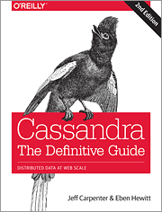

# Apache Cassandra
Этот репозиторий предоставляет образцы исходного кода и примечания для книги O'Reilly
[Кассандра: окончательное руководство(Cassandra: The Definitive Guide, 2nd Edition)](http://shop.oreilly.com/product/0636920043041.do).

Примеры доступны для следующих глав:

* Глава 8 "Клиенты" - пакет [com.cassandraguide.clients](/cassandra-tdg/src/com/cassandraguide/clients) содержит
примеры основных операций чтения, записи и метаданных, доступных через
[Драйвер Java DataStax](https://github.com/datastax/java-driver)
* Глава 9 «Чтение и запись» - [com.cassandraguide.readwrite](/cassandra-tdg/src/com/cassandraguide/readwrite) 
пакет содержит более сложные примеры, включая, батчи, транзакции и удаления
* Глава 12 «Настройка производительности» - [com.cassandraguide.performance](/cassandra-tdg/src/com/cassandraguide/performance) 
пакет содержит пример трассировки запроса
* Глава 14 «Развертывание и интеграция»  - [com.cassandraguide.integration](/cassandra-tdg/src/com/cassandraguide/integration) 
пакет содержит пример с использованием [DataStax Spark Cassandra Connector](https://github.com/datastax/spark-cassandra-connector)
Схему (CQL), cassandra-stress и образец .csv-файла для массового импорта доступны в [resources](/cassandra-tdg/resources).

Эти примеры не предназначены для представления полного приложения, но представляют собой минимальный код, необходимый 
для доступа к различным функциям Cassandra. Таким образом, примеры полезны для вырезания и вставки в ваши приложения в 
соответствии с к лицензии Apache ниже. См. [Служба резервирования](https://github.com/Dimareyscarpenter/reservation-service)
репозиторий для более полного примера.
